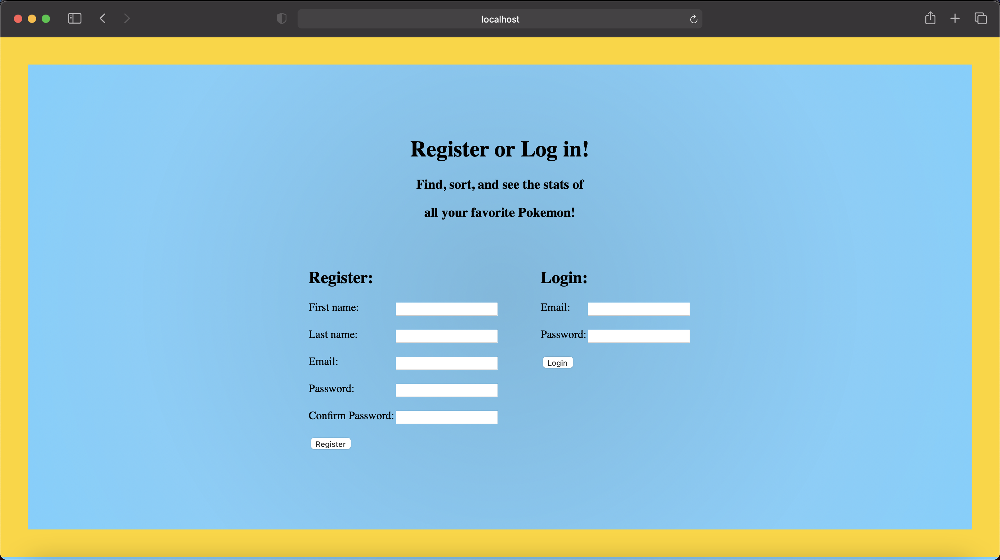
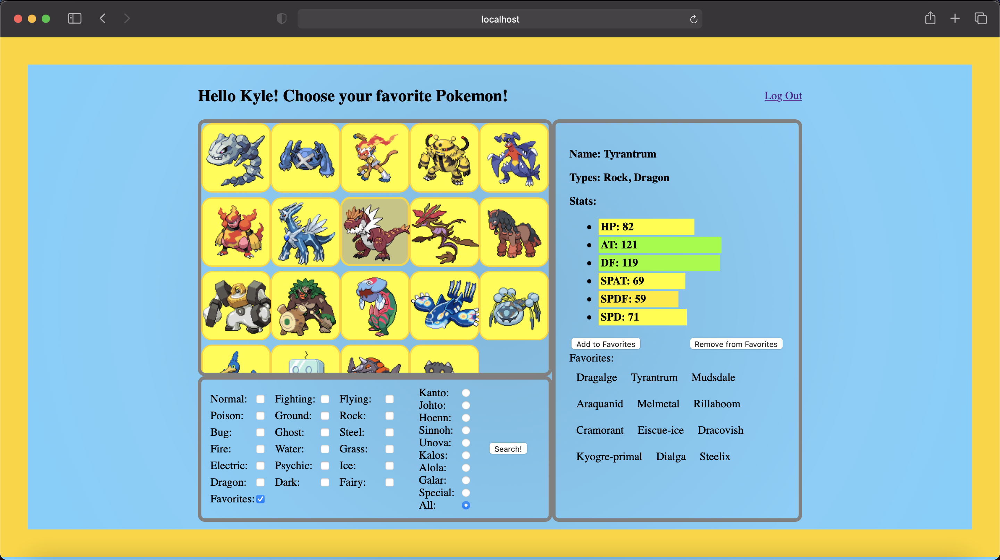
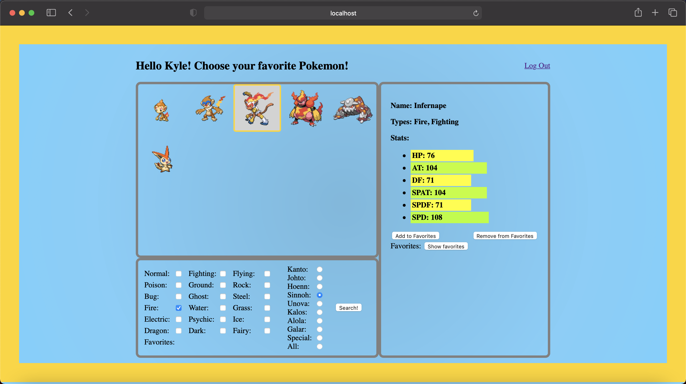
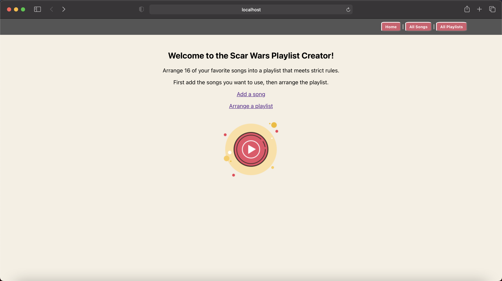
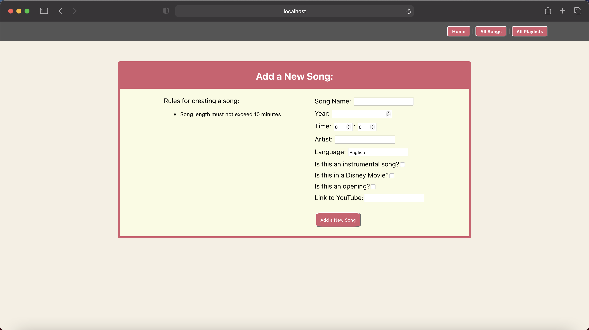
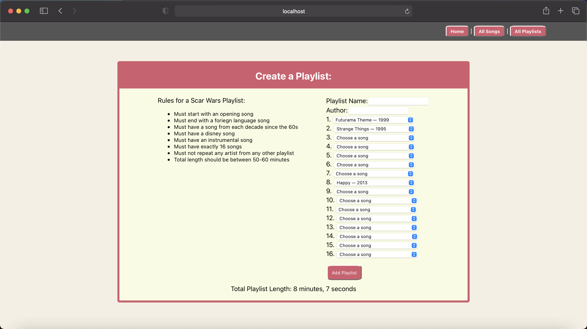

# Kyle Bricker
[LinkedIn](https://www.linkedin.com/in/kylejbricker)

Graduated San Jose State University with a B.A. in Mathematics, Magna Cum Laude.

Graduated Coding Dojo's full time three stack program with a black belt (the highest rank) in all three stacks.

## Projects:

### Favorite Pokemon
This is a small website that allows a user to browse all pokemon, whose data is retrieved from the PokeAPI, sort them by type and region, and choose their favorites, which are saved to their user account.

### Scar Wars Playlist Creator
This website allows multiple users to collaborate on creating a collection of playlists made up of songs that fit a certain pattern. It was inspired by my friend who made many of these albums. Each one had: 16 songs, started with a song that was the opening to something, ended with a song in a foriegn language, had at least one song from every decade since the 60s, was between 50 and 60 minutes total, had a disney song, and an intrumental song, and most importantly, never repeated any artists across all the playlists. This deployment-ready project will keep track of all these rules itself, and tell a user if they have made an invalid playlist.

